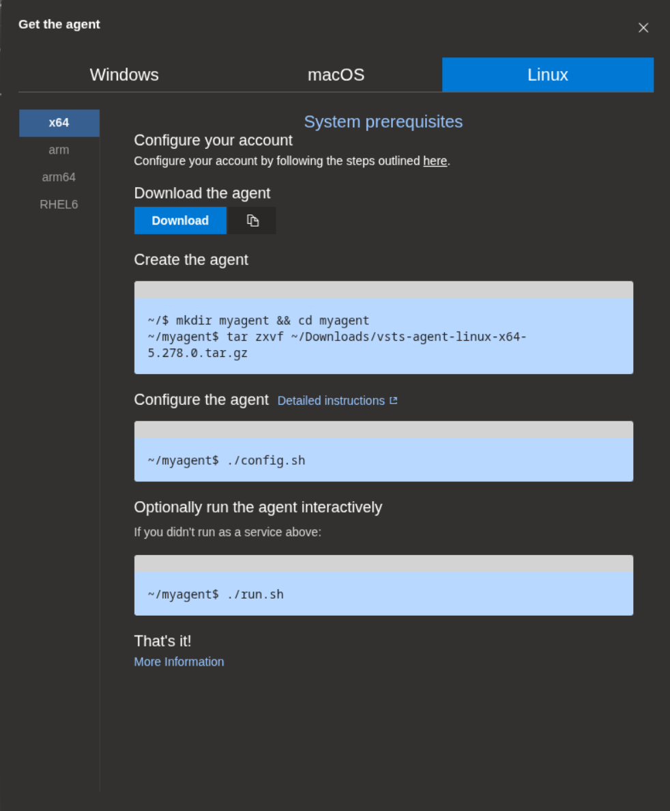

# agent-pools-azure-devops

## config

- download tar file, but please always check out [official website get agent](https://learn.microsoft.com/en-us/azure/devops/pipelines/agents/linux-agent?view=azure-devops&tabs=IP-V4)



- create an access token for your AzureDevops administrator account

```sh
mkdir example_agent && cd example_agent
```

```sh
tar -zxvf ~/Downloads/vsts-agent-linux-x64-5.278.0.tar.gz
```

- run config.sh

```sh
./config.sh
```

- add information

```sh
Enter server URL > https://dev.azure.com/yourOrganization
Enter authentication type (press enter for PAT)
Enter personal access token > ********

Enter agent pool > namePoolLocalHost
Enter agent name > exampleLocalHostAgent

Enter work folder (press enter for _work) >
```

- execute agent

```sh
./run.sh
```

## references

- check out [configure agent pools azure devops](https://learn.microsoft.com/en-us/azure/devops/pipelines/agents/windows-agent?view=azure-devops&tabs=IP-V4#permissions)
